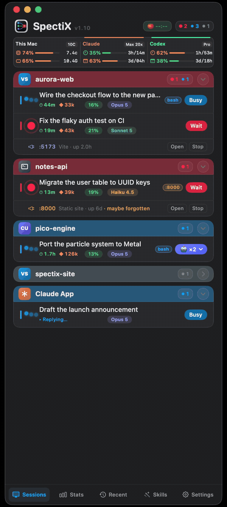
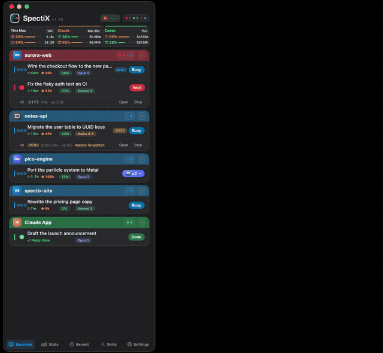
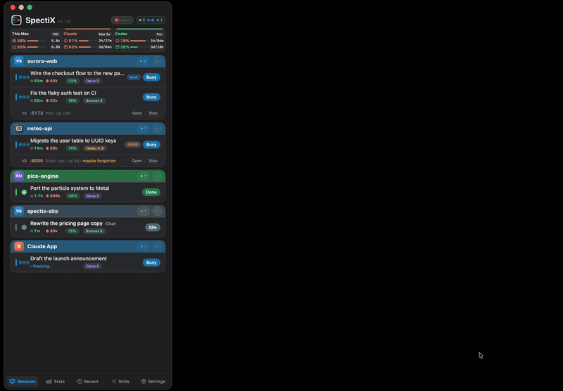
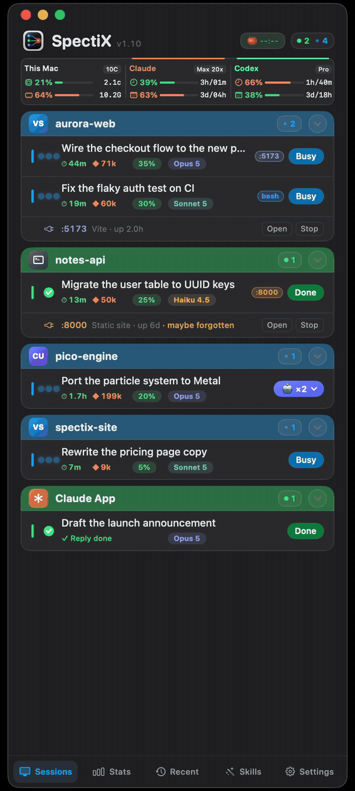
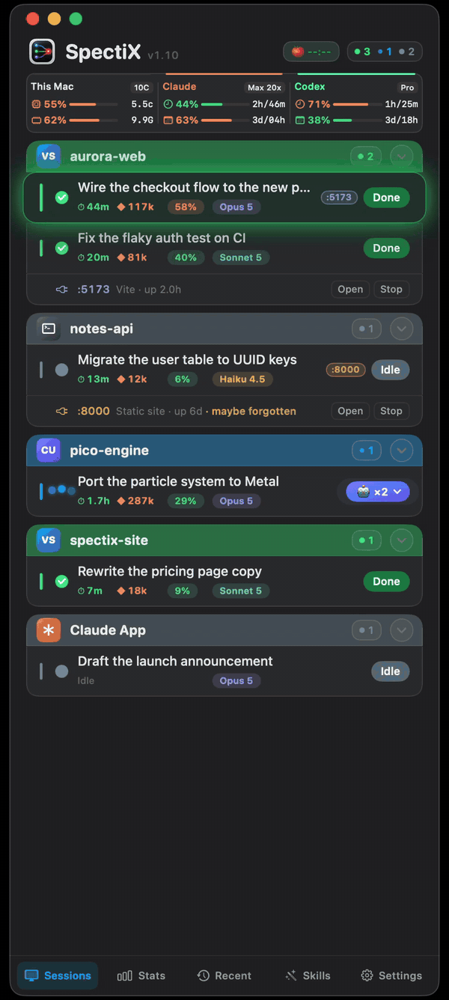
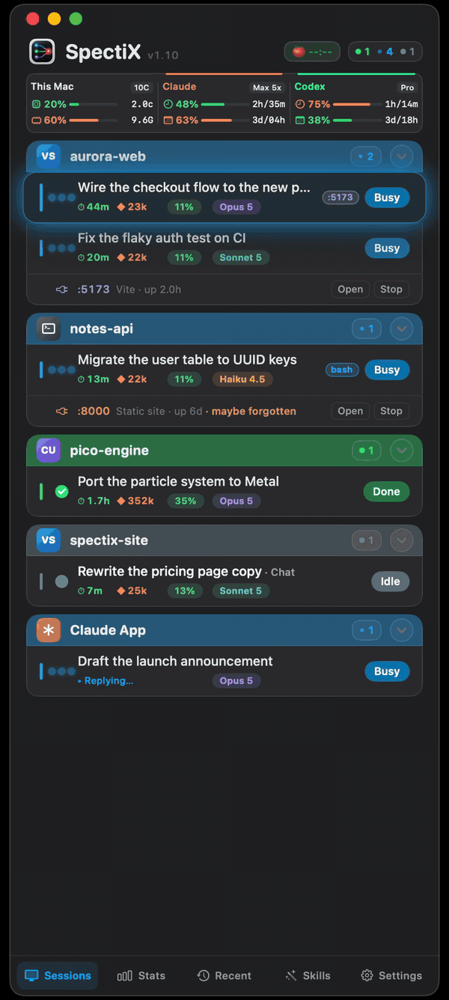

# SpectiX

[](https://spectix.app)
[](LICENSE)

Menu bar status for every Claude Code & Codex session — running, done, waiting for you — and one click to its exact terminal.


<p align="center">
  <a href="https://spectix.app/assets/spectix-tour.mp4">
    
  </a>
  <br>
  <a href="https://spectix.app/assets/spectix-tour.mp4">▶ Watch the 97-second tour (with sound)</a>
</p>

**Download:** https://spectix.app

Pure Swift + Cocoa, single binary, no third-party dependencies. macOS 13+.

## What it does

### Every session, live

Each Claude Code and Codex session shows up as a row, grouped by project: working, needs you, done, or idle. Every row also shows elapsed time, tokens, how much context is used, and which model is running.

<p align="center">
  
</p>

### One click to the right terminal

Click a row and its terminal window comes to the front, outlined by a ring in the session's status color, so you see at once where you landed.

<p align="center">
  
</p>

### The exact pane inside VS Code

With several terminals open in one VS Code window, SpectiX switches to the exact terminal that session runs in — not just the window.

<p align="center">
  
</p>

### A tap on the shoulder when it needs you

A toast appears when a session finishes or needs you. Press `⌃⌥⌘N` from anywhere to jump to the next one waiting; once you answer, the toast turns into a ✓.

<p align="center">
  
</p>

### Machine load and subscription quota

The header shows how busy this Mac is (CPU and memory — click to open Activity Monitor), plus your Claude and Codex quota for the 5-hour and weekly windows with countdowns to the next reset.

<p align="center">
  
</p>

### Switch accounts without signing in again

Open the Claude or Codex account card to see the accounts you have used, each with its plan and quota. Pick another one and newly opened terminals use it — no new sign-in.

<p align="center">
  
</p>

### Stats, recent projects and skills

**Stats** shows today's activity — sessions, active time, estimated cost, the week's quota, and token use by day and by hour. **Recent** reopens a project folder in one click. **Skills** lists every Claude and Codex skill and agent with how many times each was used.

<p align="center">
  
</p>

## Install

- **Signed build:** download from https://spectix.app. The installer places `SpectiX.app`, the hook scripts, and the companion VS Code extension.
- **From source:** see below.
- **What changed in each release:** [CHANGELOG.md](CHANGELOG.md).

## Build from source

Requirements: macOS 13+ and the Xcode Command Line Tools (`xcode-select --install`). Full Xcode is not needed.

```bash
git clone https://github.com/spectix-app/SpectiX.git
cd SpectiX
./tools/setup-signing-cert.sh   # optional, one time — see tip below
./build.sh                      # produces "SpectiX Dev.app"
open "SpectiX Dev.app"
```

Then wire the hooks (`hooks/spectix-status.sh`) into `~/.claude/settings.json` — see [`plugin/README.md`](plugin/README.md) for the hook list — and, for pane-level jumping in VS Code, run `./vscode-extension/install.sh` and reload the VS Code window.

**Signing tip:** without a signing identity, `build.sh` falls back to ad-hoc signing, which changes the code signature on every build, so macOS forgets the Accessibility grant and asks again after each rebuild. `tools/setup-signing-cert.sh` creates a stable self-signed identity named "SpectiX Dev" in your login keychain; `build.sh` uses it automatically and the grant survives rebuilds.

## How it works

1. Claude Code / Codex hooks call `hooks/spectix-status.sh` on each event (prompt submitted, tool use, permission request, stop, session start).
2. The script walks up the process tree to find the session's controlling **tty** and writes a plain-text state file: `~/.claude/spectix/state-<tty>` (`working` / `done` / `needs` / `idle`), plus the current step and title.
3. The app enumerates live `claude` / `codex` processes, reads the state file for each one's tty, and corrects known hook blind spots with process-tree probing and the Claude Code daemon's session status.

State is keyed by tty because it is unique per terminal and stable for its whole life; environment variables and session ids are not (they are shared within one VS Code window, or change mid-process).
Architecture details (in Chinese): [`docs/session-status.md`](docs/session-status.md).

## Permissions

SpectiX needs one system permission: **Accessibility**. It uses it to raise the target window on a jump, locate the exact terminal pane, read VS Code window titles to match jump targets, and detect whether the Claude desktop app is generating a reply. Screen Recording is not requested.

## Privacy: no network

The SpectiX app binary opens no network connection. This is enforced at build time: `build.sh` refuses to compile if any networking API (`URLSession`, `CFNetwork`, `NWConnection`, `socket(`, …) appears in the sources, and refuses again if the linked binary pulls in a network library.

The only outbound traffic is optional, triggered by you, and made by separate processes:

- **Apple Watch push (Bark):** off unless you enter a Bark key; the hook script sends it with `curl`.
- **Account panel:** only when you press its refresh button (or click another Claude account to switch to it), the app spawns `/usr/bin/curl` to fetch that account's quota from Anthropic. Never on a timer or at launch.

Verify it yourself:

```bash
otool -L "/Applications/SpectiX.app/Contents/MacOS/SpectiX"   # no CFNetwork, Network.framework, libcurl, libssl
lsof -i -a -p $(pgrep -x SpectiX)                            # no output while running
ls ~/.claude/spectix/                                         # everything the hooks write is plain text
```

An outbound firewall such as [Little Snitch](https://obdev.at/products/littlesnitch) or [LuLu](https://objective-see.org/products/lulu.html) will only ever see `curl` connections from the two opt-in paths above.

## Contributing

SpectiX is source-available but not open to code contributions: pull requests are closed without review. Bug reports and ideas are very welcome as [issues](https://github.com/spectix-app/SpectiX/issues/new/choose). See [CONTRIBUTING.md](CONTRIBUTING.md). Security issues: [SECURITY.md](SECURITY.md).

## License

SpectiX is source-available under the Functional Source License ([FSL-1.1-ALv2](LICENSE)). Use it free — personally or at work. You may not sell it or ship a competing product built from it. Every release becomes Apache-2.0 open source two years after it ships. Versions 1.9 and earlier were released under GPL-3.0.

The "SpectiX" name and logo are not licensed for use by forks; please rename and rebrand if you distribute a modified version.

## Third-party assets

The two photos used by the break reminder are not covered by the SpectiX license. They are used under the [Pexels License](https://www.pexels.com/license/):

- `tools/cat-stretch.jpg`: photo by Tamba Budiarsana, https://www.pexels.com/photo/979247/
- `tools/cat-glasses.jpg`: photo by Pet foto, https://www.pexels.com/photo/17753986/

## Disclaimer

SpectiX is an independent project by SpectiX Lab and is not affiliated with, endorsed by, or sponsored by Anthropic or OpenAI. Claude and Claude Code are trademarks of Anthropic, PBC. Codex is a trademark of OpenAI.
